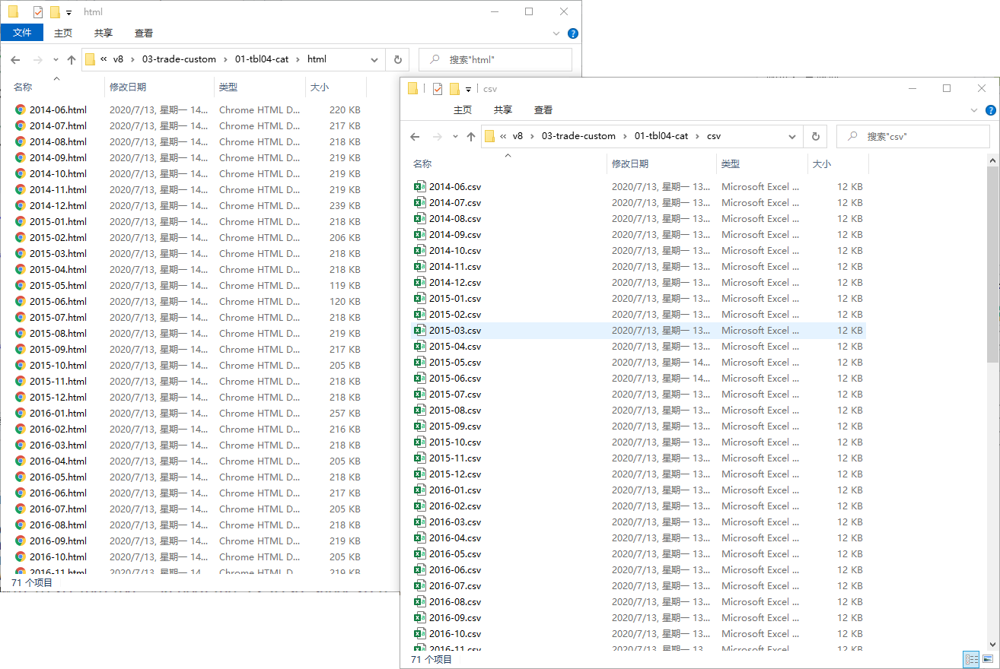
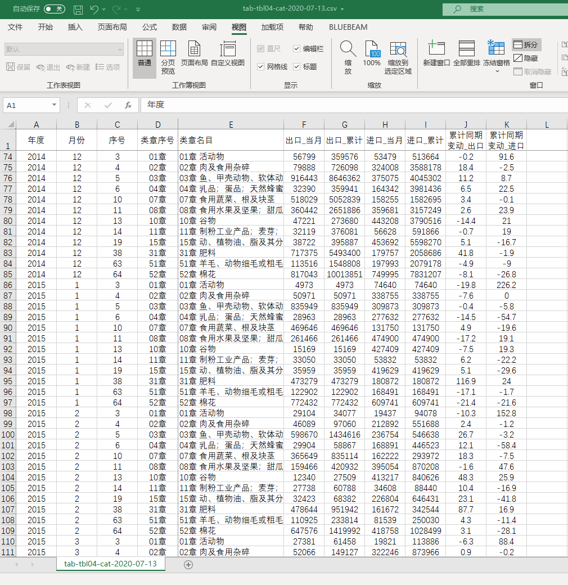

```{r, echo=FALSE}
knitr::opts_chunk$set(echo=FALSE, warning=FALSE, message=FALSE,
                      fig.align='center',fig.width=10, fig.height=7) # Places figures on their own pages
options(
  htmltools.dir.version = FALSE, 
  formatR.indent = 2, width = 55, 
  digits = 2,scipen=999,tinytex.verbose = TRUE,
  knitr.kable.NA = '',
  fig.width=12, fig.height=8)

```

```{r}
require("rvest")
require("stringr")
require("tidyverse")
require("tidyselect")
```

\newpage

# 1.数据信息概要


## 1.1资料来源：

中国海关总署《统计月报》。

- [中国海关总署](http://www.customs.gov.cn/customs/302249/302274/302277/index.html)

    - 文件标题："2020年出口主要商品量值表"\"2020年进口主要商品量值表"
    - 可下载年限范围：2014/6-2020/5
    - 文件格式：html-制式表格

- 搜数网[人大权限](https://libproxy.ruc.edu.cn/ermsClient/eresourceInfo.do?rid=136)

    - 搜数标题："2000年5月中国出口主要商品量值表统计"/"2000年5月中国进口主要商品量值表统计"
    - 可下载年限范围：2000/1-2019/12
    - 文件格式：html-形式表格


## 1.2指标和变量


农产品类章进/出口量值：

- 指标（数据列）：数量/金额【按人民币】

- 样本单位（数据行）：商品类章

- 数据频率：月度


## 1.3原始数据形态

- 中国海关总署：html表格，在线网址

- 搜数网：下载的html静态页面


# 2.数据整理过程


## 2.1数据抓取策略

同时对两个数据源进行互补式抓取：

- 2014/6-2020/5：抓取中国海关总署，在线网址形式的html表格数据

- 2000/1-2014/5：抓取搜数网，下载好的html静态页面数据

对于中国海关总署网站数据，有两个抓取办法：

>
a. 理想方法：通过Rselenium+docker的办法自动化抓取到所需表格的所有月份页面的实际网址url，然后批量下载保存成静态页面。

>
b. 手工办法：进入海关网站，手动下载每个月份页面的实际静态网页到本地。工作量初步估计：进出口量值的页面数=7年x12月x2类=`r 7*12*2`


## 2.2抓取环节1：中国海关总署统计月报

基本过程：

a. 以源文件方式保存[主站](http://www.customs.gov.cn/customs/302249/302274/302277/index.html)。

b. 第一步是需要获得指定“主题”（例如“进口主要商品量值表”）下所有月份的实际网址url。具体细节见后面的`R`代码（见节\@ref(auto-url)）。

c. 根据获取的实际url，下载全部静态表格网页到本地，并批量命名。

d. 通过下载所有月份的静态网页html（含有数据表），然后再进行数据整合。


主要关注如下几类网页表：

- 表4：**“进出口商品类章总值表”**

- 表13/14：**“出口/进口主要商品量值表”**。主要商品较具体，重点关注：肉及杂碎（其子类中的牛肉、猪肉、羊肉）、谷物及谷物粉（其子类中的稻谷和大米、玉米、豆类）等。

- 表15/16：**“对部分国家（地区）出口/进口商品类章金额表”**。按类章、并区分与部分国家的进出口贸易关系。


### 2.2.1.下载并保存主站网页源代码

注意：
>
- 具体操作：chrome浏览器打开网址 $\Rightarrow$ 查看源代码 $\Rightarrow$ 复制所有源代码到 notepad++ 保存为UTF-8格式下的txt文件。
>
- 说明：因为网站采用了js框架，不能直接静态拉取页面的所有信息（例如`read_html()`）。而采用动态拉取方法也会失效（例如`RSelenium + docker`的方式）。


### 2.2.2.自动抓取url的R代码实现{#auto-url}

我们可以直接分析网页的源代码文件^[动态化抓取的办法见[参考资料](https://statistics.berkeley.edu/computing/r-reading-webpages)]。

> **说明**："2015年进口主要商品量值表" 1月页面链接无效

以下为R代码具体实现过程：

```{r, echo=T}
# step 1: save the source code web as .txt file

# step 2: read the txt file with correct encoding type
the_page <- readLines("00-web-hack/page-all-index.txt", encoding = "UTF-8")

# step 3: specify the needed table title
the_title <- "自部分国家(地区)进口商品类章金额表"

# step 4: create the whole url scrape function

get_url <- function(page=the_page, title=the_title){
  # 4.1 locate the line number
  id_currency <- grep("表名 （", page)
  id_head <- grep(title, page)
  id_url <- id_head+1
  # 4.2 choose the useful lines
  tbl_choose <- tibble(id_currency = grep("表名 （", page),
         id_head = grep(title, page),
         id_url = id_head+1,
         txt_currency=page[id_currency],
         txt_head= page[id_head],
         txt_url=page[id_url])
  # 4.3 extract the currency/year/variables
  tbl_extract <- tbl_choose %>%
    # extract currency
    mutate(currency= str_extract_all(txt_currency, "(?<=（)(.+)(?=）)")) %>%
    mutate(currency= str_replace(currency, " ", "")) %>%
    # extract year
    mutate(year=as.numeric(str_extract_all(txt_head, "(?<=\\))(\\d{4})"))) %>%
    # extract variables
    mutate(variables=str_extract(txt_head, "进口|出口|进出口"))
  # 4.4 map function which we can extract the month and its real url
  extract_url <- function(txt){
    text_tbl <- tibble(text=unlist(str_split(txt,pattern ="</a>"))) %>%
      filter(str_detect(text,"月")) %>%
      mutate(text=str_replace_all(text,"><a", "<a")) %>%
      # extract month
      mutate(month=str_extract(text,  pattern = "(?<=>)(.+)(?=月)")) %>%
      # extract url
      mutate(url=str_extract(text,  pattern = "(?<=http://)(.*.html)"))
    return(text_tbl)
  }
  # 4.5 map and unnest  
  tbl_map <- tbl_extract %>%
    mutate(tbl=map(.x=txt_url, .f = extract_url )) %>%
    unnest(cols = tbl) %>%
    select(currency,variables,year,month, url ) 
    
  
  return(tbl_map)
}

# tbl_show <- get_url(title = "自部分国家(地区)进口商品类章金额表")

```


下面，我们把所有感兴趣的主体的url地址全部抓取下来：

```{r, echo=TRUE}
# set topic we need
all_title <- c("进出口商品类章总值表",  # 表4 
               "出口主要商品量值表",    # 表13
               "进口主要商品量值表",    # 表14
               "出口商品类章金额表",    # 表15
               "进口商品类章金额表")    # 表16
number_tbl <- paste0("表", c(4,13:16))
# loop for all table
### i <-1
tbl_all <- NULL
for (i in 1:length(all_title)){
  tbl_show <- get_url(page=the_page, title = all_title[i]) %>%
    add_column(table=all_title[i], .before = "currency") %>%
    add_column(number=number_tbl[i], .before = "table") 
  tbl_all <- bind_rows(tbl_all, tbl_show)
  print(number_tbl[i])
}

tbl_all <- tbl_all %>%
  # handle the month with leading zero
  mutate(month= str_replace(month, "1-2", "2")) %>%
  mutate(month=str_trim(month, side = "both")) %>%
  mutate(month=str_pad(month, width = 2, pad = "0"))

```

抓取的最后结果如下：

```{r}
# just for chunk set: screenshot.opts = list(selector = ".dataTable")
#install.packages("webshot")
#webshot::install_phantomjs()
require("webshot")
# total numbers of urls
n_tot <- tbl_all %>% nrow(.)
# show result
tbl_all %>%
    filter(!is.na(url)) %>%
    DT::datatable(caption=paste0("月度网页实际url自动抓取结果(条数n=", n_tot, ")"),
                  options = list(dom="tim", pageLength=10), rownames = FALSE)
```

最后我们把抓取结果保存在本地：

```{r, echo=TRUE, eval=FALSE}
# write out files
file_name<- paste0("00-web-hack/auto-url-",Sys.Date(),".csv")
write.csv(tbl_all, file = file_name, row.names = FALSE)
```

### 2.2.3. 批量化下载url静态页面到本地

**异常页面**：

- 图片形式的页面。2017-08-D.html


**第一步**：读取并整理所有url。

```{r, echo=T, eval=FALSE}
# set topic we need
all_title <- c("进出口商品类章总值表",  # 表4 
               "出口主要商品量值表",    # 表13
               "进口主要商品量值表",    # 表14
               "出口商品类章金额表",    # 表15
               "进口商品类章金额表")    # 表16
number_tbl <- paste0("表", c(4,13:16))

# read the csv file on all urls
tbl_all <- read.csv("00-web-hack/auto-url-2020-07-13.csv")

title_match <- tibble(file_dir = c("01-tbl04-cat", 
  "02-tbl13-cat-export","03-tbl14-cat-import",
  "04-tbl15-country-export","05-tbl16-country-import"),
  table = all_title)

#  tidy url and create file path for each url
tbl_urls <- tbl_all %>% 
  dplyr::filter(!is.na(url)) %>%          # filter NULL urls
  #dplyr::filter(currency=="人民币") %>%   # only need the RMB table
  mutate(cur = if_else(currency=="人民币", "R", "D")) %>%
  mutate(url=paste0("http://", url)) %>%  # fill the actual urls
  # for the name with leading zero
  mutate(month=str_pad(month, width = 2, pad = "0")) %>%  
  # the file name
  mutate(file_name = paste0(year, "-", month ,"-",cur,".html")) %>%
  # the dir name
  left_join(x=., y=title_match, by="table") %>%
  # the file path
  mutate(file_path = paste0(file_dir, "/html-01-custom/", file_name))

# backup for reuse
write.csv(tbl_urls, "tbl-urls-backup-custom.csv", row.names = F)
```


**第二步**：利用docker+RSelenium下载所有url对应的静态html到本地。

- 环境准备。安装docker desktop，进行配置（主要是registry mirror设置为国内服务器；确保bios开启虚拟化服务）。拉取pull安装selenium/chrome以及firefox到本地。

- 设计Rselenium包的server-client交互过程。docker启用container时，浏览器的选择很重要，chrome无法进入网页，但是firefox可以。

- 利用其他R包配合，自动化下载静态html到本地硬盘。其中的关键就是利用RSelenium读取源文件，然后用`xml2::read_html()`转化为html，最后再由`xml2::write_xml()`写出到本地。

说明：

- “表14：2015年进口主要商品量值表（人民币）1月份”的url为空。

具体R代码如下：

#### 使用selenium浏览器下载

可以尝试使用docker selenium浏览器。（能否成功，根据目标网站情况而定）。

```{r, eval=FALSE,echo=T}
# 0. load R pkgs
library("RSelenium")
library("xml2")

# you should set the table number to download all html for each url
url_list <- tbl_urls %>%
  filter(number == "表15")  

# 1. run docker service and container
#### you should run and start docker desktop first.
#### then run code in 'window power shell': docker run -d -p 4445:4444 selenium/standalone-firefox

# 2. create the remote driver
remDr <- remoteDriver(remoteServerAddr = "192.168.56.1", port = 4445L, 
                      browserName = "firefox")
## open the connect
remDr$open()

# i<-  c(75)

for (i in 75:nrow(url_list) ){
  # navigate the url
  remDr$navigate(url_list$url[i])
  # wait seconds
  Sys.sleep(15)
  # confirm you got there
   print(remDr$getTitle())
  # check on there
  remDr$screenshot(display = TRUE)
  # get the page source
  webpage <- remDr$getPageSource()[[1]]
  # wait seconds
  Sys.sleep(2)
  # read as html object
  html_obj <- xml2::read_html(webpage)
  # write out the html file
  xml2::write_xml(html_obj, file=url_list$file_path[i])
  
  print(paste0("第",i,"个页面。",url_list$file_name[i], "已经下载完成！"))
}


```

#### 使用系统浏览器下载

如果前述方法不能顺利执行，则可以尝试使用系统自带浏览器。（测试成功率较高）。

```{r}
# 0. load R pkgs
library("RSelenium")
library("xml2")

# you should set the table number to download all html for each url
url_list <- tbl_urls %>%
  filter(number == "表16")  

# 1. run docker service and container
#### you should run and start docker desktop first.
#### then run code in 'window power shell': docker run -d -p 4445:4444 selenium/standalone-firefox

driver <- rsDriver(browser=c("firefox"))
remDr <- driver[["client"]]
remDr$open()

# i<-  c(1)

for (i in 4:nrow(url_list) ){
  # navigate the url
  remDr$navigate(url_list$url[i])
  # wait seconds
  Sys.sleep(3)
  # confirm you got there
   print(remDr$getTitle())
  # check on there
  #remDr$screenshot(display = TRUE)
  # get the page source
  webpage <- remDr$getPageSource()[[1]]
  # wait seconds
  Sys.sleep(1)
  # read as html object
  html_obj <- xml2::read_html(webpage)
  # write out the html file
  xml2::write_xml(html_obj, file=url_list$file_path[i])
  
  print(paste0("第",i,"个页面。",url_list$file_name[i], "已经下载完成！"))
}


#close the driver
remDr$close()

#close the server
remDr$server$stop()
```


#### 核对最终下载页面数

（可能会少于后者）与实际下载页面数是否一致

因为原始`tbl_com`里可能存在标题重复或错误，从而导致最终下载页面数会少于实际下载页面数。

处理办法如下：
- 列表最终下载页面，`tbl_files`。
- 列表实际下载页面，`tbl_urls`。
- 查看二者行数是否一致（前者少于后者9个）
- 检查实际下载页面，`tbl_urls`的列`name_file`是否存在重复，以及哪些行重复
- 追踪到tbl_com.csv，定位到这些行，并查明原因。一类原因是title错误，确认后直接在csv里修改好；二类原因是确实重复了，那可以直接忽略（因为下载后会自动覆盖这些重复urls）

下面是检查代码：

```{r, eval=FALSE}
# read backup urls
tbl_full <- read.csv("tbl-urls-backup-custom.csv") %>%
  filter(number=="表15") %>%
  add_column(ID=1:nrow(.), .before = "number") %>%
  select(ID, file_name) %>%
  rename("name_file" = "file_name")
  


# files html path
### you should change the dir according to the purpose
### tbl15 or tbl16
files_dir <- here::here("data", "v8", "03-trade-custom", "04-tbl15-country-export","html-01-custom")
# files_dir <- here::here("data", "v8", "03-trade-custom", "05-tbl16-country-import","html-01-custom")

files_html <- list.files(str_c(files_dir,"/"))
page_url <- str_c(files_dir, files_html, sep = "/")

# table the files
tbl_files <- tibble(name_file=files_html,
                    size = round(file.size(page_url)/1024,0)) %>%
  add_column(ID = 1:nrow(.), .before = "name_file") %>%
  mutate(year= str_extract(name_file, "(\\d{4})(?=-)"),
         month= str_extract(name_file, "(?<=-)(\\d{2})")) %>%
  mutate(currency   = str_extract(name_file, "(.{1})(?=\\.)")) %>%
  mutate(path_file = paste0("html-01-custom/", name_file)) 

# check
check_sum <- tbl_files %>%
  group_by(year, month) %>%
  summarize(n=n(), .groups="drop")

# check file size not normal
check_size <- tbl_files %>%
  select(name_file, size) %>%
  filter(size < 200) 

check_error <- check_size %>%
  left_join(., tbl_full, by="name_file")

list_download <- check_error$ID


```


以下是**缺失性**核查的结果：

- **表15**：对部分国家(地区)出口商品类章金额表：
    - 2014-04 到2015-01，都是图片格式，无法识别。
    - 2017-08。图片格式，无法识别。


- **表16**：自部分国家(地区)进口商品类章金额表：
    - 2016-12，缺失网页表格；但是可以下载到excel表格。 后面需要单独处理。保存在`05-tbl16-country-import\hack-sooshu\extra-custom\2016-12-D.xls`和`05-tbl16-country-import\hack-sooshu\extra-custom\2016-12-R.xls`


### 2.2.4. 把html转换为对应的csv，并提取整合有效数据

具体的R操作在每一类表（表4、表13、……）的文件夹里【也可见视频 step3】。

**第一步**：利用R编程，自动把本地的静态html文件，分别转换为csv文件（xlsx就能打开查看的。）。

```{r, fig.cap="把所有html文件分别转换成对应的csv文件"}

```


**第二步**：从所有的csv文件中提取有用的信息。合并并保存到本地csv。

```{r, fig.cap="提取csv文件中的有用数据，并整合成一个数据文件"}

```
