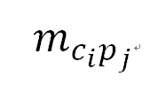

```{r global_options, echo=F,message=FALSE,warning=F}
source(here::here("R","set-global.R"))


```


# 研究目标

# 文献分析

## 截面分解模型

$Y= \beta_0 +\beta_1X_1 + \beta_2 X_2$

$\frac{\sqrt{a^2+b^2}}{-2}\sum_1^{n}{x^2}$

1. 理论来源

2. 数理模型

3. 公式分解

> 爱因斯坦怎么说。

## 时序分解模型

[@li2018]

bernard （@bernard2009）

下面展示一张图片

```{r, fig.cap= "缺失数据的形态", fig.align="l",fig.height=5}
knitr::include_graphics(here::here("pic","missing-data.jpg"))

```


# 参考文献

第一步：打开github[首页](www.github.com) ; $\Rightarrow$输入用户名。的发掘大家是否了解的地方。
