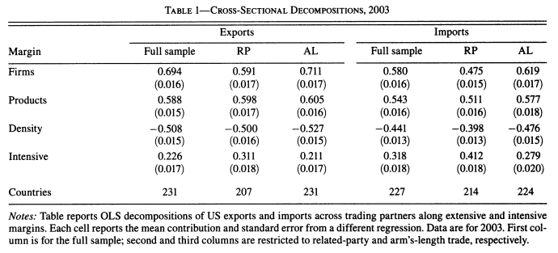
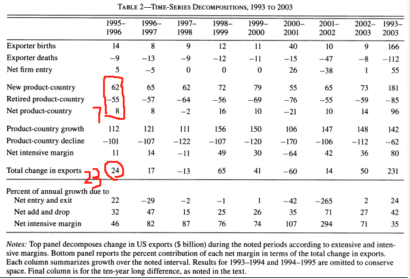

```{r global_options, echo=F,message=FALSE,warning=F}
source("../R/set-global.R")
```


# 1. 研究目标

1.1 我国在美洲国家的粮食中心能否转移到"一带一路"国家上

- 我国主要农产品进/出口国家和地区的趋势和关系

- 能否转移（贸易流）

1.2 如何转移，需要什么条件

# 2. 数据来源 

2.1 现有数据

-中国商务部：农产品月度统计报告2002年1月-2020年3月(pdf)(具体农产品前三贸易伙伴)

-中国海关(搜数网)：2000年1月-2020年5月中国与44个国家粮食产品进、出口数据

-FAO

-美国农业部

2.2 需要数据

-中国与贸易伙伴国农产品贸易月度数据

# 3. 文献分析

3.1 主要文献

1. A. B. Bernard, J. B. Jensen, S. J. Redding和P. K. Schott, 《The Margins of US Trade》, American Economic Review, 卷 99, 期 2, 页 487–493, 4月 2009, doi: 10.1257/aer.99.2.487.

2. C. Xie, J. Gao, J. H. Grant和S. Anders, 《Examining the Canada-China agri-food trade relationship: Firms, trading partners, and trading volumes》, Canadian Journal of Agricultural Economics/Revue canadienne d’agroeconomie, 卷 66, 期 4, 页 539–555, 12月 2018, doi: 10.1111/cjag.12172.

3.2 文献综述


$m_{ki}^{jk}$

$\text{sum of }\sum{x^2}= $

$-\sum_1^N{\frac{(a+b)^2}{2+c}}$

$\cdots$

$\cdot$

$\hat{\beta}$

$\Rightarrow$

$\beta^{\ast}$

$\bar{\beta}$

$\tidle{}$


# 4. 理论研究

## 4.0 理解原文

### 截面分解

贸易额分解恒等式：

$$\begin{equation}
x_c=f_c \cdot  p_c \cdot d_c  \cdot \bar{x}_c
\end{equation}$$

- $x_c$表示与国家c之间的加总贸易额

- $f_c$表示与国家c进行贸易的企业数
- $p_c$表示与国家c进行贸易的产品数
- $d_c$表示与国家c进行贸易的密度
- $\bar{x}_c$表示与国家c进行贸易的平均贸易额

- 那么$\frac{x_c}{f_c p_c}$表示表示与国家c进行贸易下，每个**“企业-产品”组合**的平均贸易额。

其中1：贸易密度$d_c=\frac{o_c}{f_c \cdot p_c}$，

- 而$o_c$表示与国家c进行贸易下，贸易额为正的**“企业-产品”组合**数量。


其中2：平均贸易额$\bar{x}_c=\frac{x_c}{o_c}$，

- 而$o_c$表示与国家c进行贸易下，贸易额为正的**“企业-产品”组合**数量。


举个例子：

```{r}
require("glue")
set.seed("123")

tbl_demo <- data.frame(matrix(runif(min = 500, max = 1000,n = 20), nrow = 4, ncol = 5),
                       row.names = glue("p{1:4}"))

names(tbl_demo) <-glue("f{1:5}")

tbl_demo[c(2,4), c(1,3,5)] <- NA

xc <-tbl_demo %>%
  transmute(rsum=rowSums(., na.rm = T)) %>%
  summarise(tot = sum(rsum))

pc <-dim(tbl_demo)[1]
fc <-dim(tbl_demo)[2]
oc <- pc*fc - sum(is.na(tbl_demo))  
dc <- oc/(fc*pc)
x_bar <-xc/oc

d_l<- min(1/pc,1/fc)
```


```{r demo-trade}
options(knitr.kable.NA = 'NA')
tbl_demo %>%
  #mutate_all(replace_na, replace="-") %>%
  kable(align = "c", caption = "假象的贸易案例数据T0")
```


以上贸易情形中（见表\@ref(tab:demo-trade)）：

- 加总贸易额$x_c=\sum_{1}^{16}{a_{ij}}=$ `r round(xc,0)`

- 与国家c进行贸易的企业数$f_c=$ `r dim(tbl_demo)[2]`
- 与国家c进行贸易的产品数$p_c=$ `r dim(tbl_demo)[1]`
- 贸易额为正的**“企业-产品”组合**数量$o_c =$ `r oc`。
- 与国家c进行贸易的密度$d_c=\frac{o_c}{f_c \cdot p_c}=\frac{10}{16}=$ `r round(dc,2)`
- 与国家c进行贸易的平均贸易额$\bar{x}_c=\frac{x_c}{o_c} = \frac{10719}{14}=$ `r round(x_bar,2)` 


### 时序分解

$$\begin{equation}
\Delta x_{t}=\sum_{f \in N} x_{f t}-\sum_{f \in E} x_{f t-1}+\sum_{f \in C} \Delta x_{f t}
\end{equation}$$

$$\begin{equation}
\Delta x_{f t}=\sum_{j \in A_{f}} x_{f j t}-\sum_{j \in D_{f}} x_{f j t-1}+\sum_{j \in G_{f}} \Delta x_{f j t}+\sum_{j \in S_{f}} \Delta x_{f t}
\end{equation}$$


- 贸易额变动$\Delta x_t=x_t- x_{t-1}$
- 由于新企业加入，引发的贸易额变动$\sum \limits_{f \in N}x_{ft}$
- 由于企业退出，引发贸易额的变动$\sum \limits_{f \in E} {x_{ft-1}}$ 
- 存续的企业，因为贸易量增减引发贸易额的变动$\sum \limits_{f \in C} {x_{ft}}$，这部分又可以进一步分解为：

    a. 由于新增**“国家-产品”**对引发的贸易额变动：$$\sum \limits_{j \in A_{f}} x_{f j t}$$
    b. 由于放弃**“国家-产品”**对引发的贸易额变动: $$\sum \limits_{j \in D_{f}} x_{f j t-1}$$
    c. 由于已有**“国家-产品”**对的**贸易增长**引发的贸易额变动: $$\sum \limits_{j \in G_{f}} x_{f j t}$$
    d. 由于已有**“国家-产品”**对的**贸易萎缩**引发的贸易额变动: $$\sum \limits_{j \in S_{f}} x_{f j t}$$


例如，假设另一个时期的贸易情况表如下所示：

```{r}
require("glue")
set.seed("1234")

tbl_demo1 <- data.frame(matrix(runif(min = 500, max = 1000,n = 30), nrow = 5, ncol = 6),
                       row.names = glue("p{1:5}"))

names(tbl_demo1) <-glue("f{1:6}")

tbl_demo1[c(2,4), c(1,3,5)] <- NA
tbl_demo1[c(2), c(2)] <- NA
tbl_demo1[c(1), c(6)] <- NA

xc <-tbl_demo1 %>%
  transmute(rsum=rowSums(., na.rm = T)) %>%
  summarise(tot = sum(rsum))

pc <-dim(tbl_demo1)[1]
fc <-dim(tbl_demo1)[2]
oc <- pc*fc - sum(is.na(tbl_demo1))  
dc <- oc/(fc*pc)
x_bar <-xc/oc

d_l<- min(1/pc,1/fc)
```

```{r demo-trade1}
options(knitr.kable.NA = 'NA')
tbl_demo1 %>%
  #mutate_all(replace_na, replace="-") %>%
  kable(align = "c", caption = "假象的贸易案例数据T1")
```

请根据上述$T_0$和$T_1$两个时期贸易数据，进行相应的时序分解计算

<br>

<br>

## 4.1 截面分解模型

### 论文中的模型分析

国际贸易中往往会存在较大的截面数据差异，例如中国从美洲国家如美国、加拿大、阿根廷等国家进口的粮食总量和总额远远大于中国从一些依赖农业贸易的小国家进口的总量和总额。

因此，对于中国与其他国家的粮食贸易总额，可以在横截面上分解为国家层面、产品层面、国家-产品密度、国家-产品强度。


随着公司和产品的数量在不同国家之间增长，可能的公司-产品观察(firm-product)的数量会成倍增加。如果企业在不同国家的产品中都是相对恒定的子集，那么观察到的具有正贸易的企业产品的实际数量将不成比例地增加，从而导致密度下降。在这种情况下,公司和产品数量越大的国家，其贸易密度就越小，这意味着密度与贸易公司数量和贸易产品数量呈负相关关系。

密度系数和产品数量的回归系数的总和产生了每个公司的产品数量的百分比贡献，即以正的数量进行产品交易。

```{r}

```

上表报告了第t年回归截面分解的结果。对每个变量进行独立回归，结果为每个变量的系数之和为1。仅分析出口情况：第一列为对全样本的回归，第二列为交叉出口，第三列为独立出口。第一行系数为公司数量对两国贸易总量的影响程度，第二行系数为产品数量对两国贸易总量的影响程度，第三行为公司-产品密度对两国贸易总量的影响程度，第四行为公司-产品强度体系数解释为


如第一列的最后一行所示，整体利润率解释了美国出口目的地之间22.6%的平均差异。另一方面，出口企业数量(第一行)和出口产品数量(第2行)的变化分别占变化的69.4和58.8%。如上所述，密度的负系数为-0.508(第3行)，反映了密度与美国贸易产品数量、贸易公司数量和贸易总额呈负相关。尽管如此，这三个广泛的利润条件的总和仍然占总体出口变化的绝大多数(77.4%)。


## 4.2 时序分解模型

```{r}

```

```{r}
include_graphics("../pic/fig3.percentage.png")
```

## 模型修改

已知：
- t-1到t年的贸易额
- t-1到t年的国家数
- t-1到t年的产品数
- 面板数据：t年贸易伙伴国固定产品的贸易额

```{r}
include_graphics("../pic/fig4.png")
include_graphics("../pic/fig5.jpg")
```


